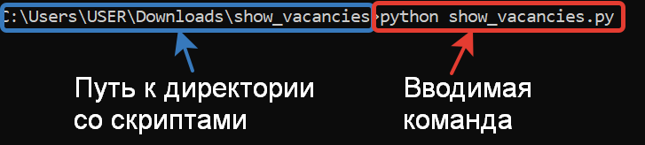
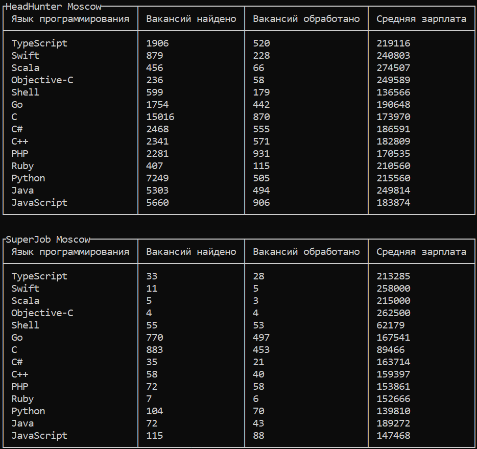

# Сравниваем вакансии программистов

Скрипт show_vacancies отображает две таблицы с вакансиями по языкам программирования с сайтов HeadHunter.ru
и SuperJob.ru.

### Как установить

Для успешной работы скрипта нужно получить [секретный ключ](<https://api.superjob.ru/info/>).

Этот ключ следует записать в файл .env в следующем виде.

```
API_SUPERJOB=Ваш сгенерированный секретный ключ
```

Python3 должен быть уже установлен. 
Затем используйте `pip` (или `pip3`, есть есть конфликт с Python2) для установки зависимостей:
```
pip install -r requirements.txt
```

Запустить скрипт можно через командную строку:



После запуска скрипта в телеграм-канале "Космические фотографии" появятся новые фото, после того как они скачаются на ваш компьютер.



### Цель проекта

Код написан в образовательных целях на онлайн-курсе для веб-разработчиков [dvmn.org](https://dvmn.org/).